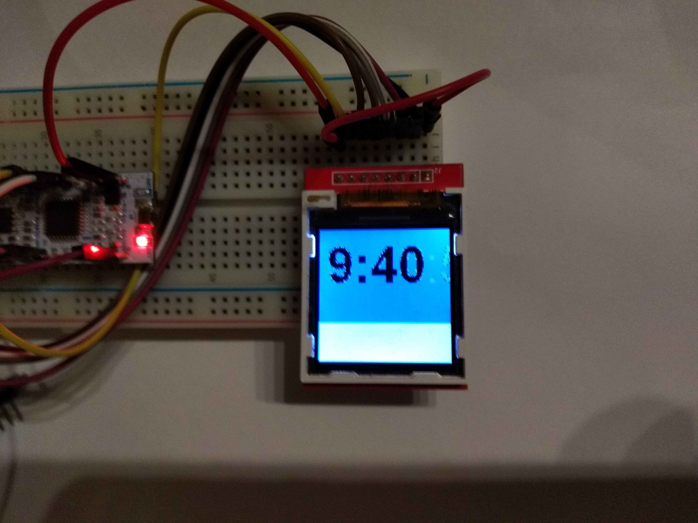

# VRS-Wifi_Lcd_Project
This project was developed as final project during the course Embedded control systems at faculty of <b>Electrical Engineering and Information Technology of Slovak University of Technology in Bratislava</b>. This project allows creating screenshot about the wished webpage and displaying the selected area on connected LCD. The following boards and firmwares were used STM32f808, NodeMCU, ILI9163C display and the NodeJS. 
<h3>Example output</h3>
 

